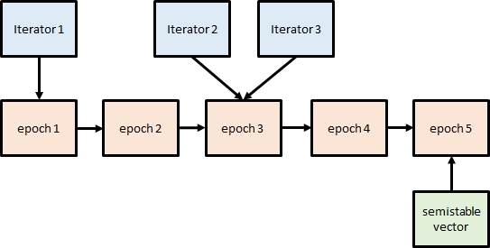
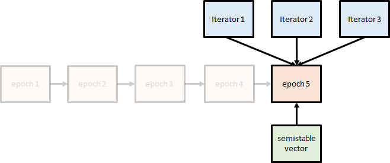
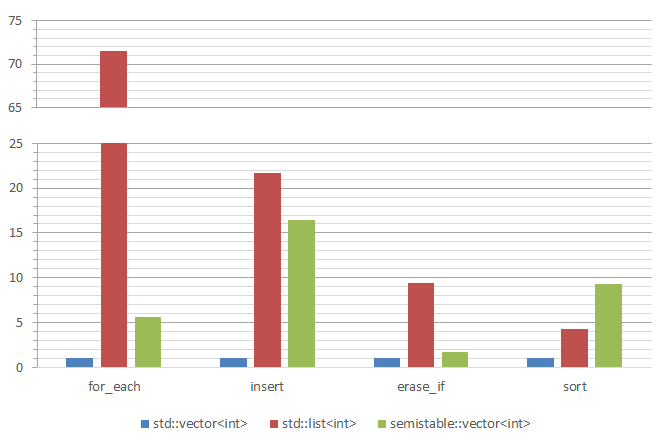

# A proof of concept of a semistable vector container

```cpp
#include <semistable/vector.hpp>
#include <iostream>

int main()
{
  semistable::vector<int> x = {0, 1, 2, 3, 4, 5, 6, 7, 8, 9};

  auto it = x.begin() + 5;
  std::cout << *it << "\n"; // prints 5

  x.erase(x.begin());       // erases first element

  std::cout << *it << "\n"; // prints 5 again!
}
```

`std::vector` stores its contents in a contiguous block of memory, so mid insertions and
erasures invalidate references and iterators to previous elements. `semistable::vector`
is called _semistable_ in the sense that, while references are still unstable, its iterators
correctly track elements in situations like the above.

`semistable::vector` stores elements contiguously and provides the same API as `std::vector` with the extra
guarantee of iterator stability (including `end()`). The library is header-only and depends solely on
[Boost.Config](https://www.boost.org/doc/libs/latest/libs/config/doc/html/index.html).
C++11 or later required.

## Implementation

From the point of view of stability, there are three types of operation that cause iterators
to become invalid in a classical `std::vector`:

* insertion of elements before a given position,
* erasure of elements before a given position,
* reallocation to a new buffer (e.g. with a call to `reserve`).

When any of these operations happens, `semistable::vector` creates a new _epoch_ descriptor
indicating the change. Outstanding iterators internally point to an epoch (past or current).
All arrows in the diagram are `std::shared_ptr`s:



When the iterators are used, they follow the chain of epoch descriptors till the last one,
making the necessary adjustments to their stored position along the way. This ensures that
dereference (as well as other iterator operations) are consistent with the current state
of the vector:



When an epoch descriptor is outdated (all outstanding iterators are passed it), it gets automatically
deleted (no `shared_ptr` points to it any longer).

## Performance

The graph shows normalized execution times of the following operations:

* traversal with `for_each`,
* repeated insertion at the end,
* `erase_if` of odd elements,
* sorting of elements,

for `std::vector<int>`, `std::list<int>` and `semistable::vector<int>` with 0.5M elements.
Results are normalized to the execution time of `std::vector`. Benchmarks compiled with
clang-cl for Visual Studio 2022 in release mode.



Some observations:

* `semistable::vector` iterators provide a `raw()` member function returning a
plain pointer to the element (this is equivalent to calling
[`std::to_address`](https://en.cppreference.com/w/cpp/memory/to_address.html) on the
iterator). When using `raw()` for traversal and
sorting (that is, `std::for_each(x.begin().raw(), x.end.raw(), ...)`,
`std::sort(x.begin().raw(), x.end.raw()`), execution times are the same as with
`std::vector`. C++20 introduces the notion of
[_contiguous iterators_](https://en.cppreference.com/w/cpp/iterator/contiguous_iterator.html),
which standard algorithms could in principle take advantage of by internally
converting contiguous iterators to pointers for increased performance.
In reality, though, no standard library implementation does that except for a handful
of algorithms with a high chance of being eligible for autovectorization.
* `std::list::sort` is not entirely equivalent to sorting a vector (semistable or
otherwise), as the former sorts _nodes_ whereas the latter sorts _values_. So,
a `std::list` iterator will point to the exact same value after sorting, which is
not the case for vectors.

## Limitations and potential extensions

### Thread safety

Like standard C++ containers, `semistable::vector` const and
[const-like](https://eel.is/c++draft/containers#container.requirements.dataraces-1) member
functions are thread safe. Iterator usage, however, requires extra precautions:

* The same iterator object can't be used concurrently in different threads, even for
nominally const operations such as dereferencing (internally, thread-unsafe epoch traversal is
triggered).
* An iterator can't be used concurrently with any thread-unsafe operation on
the `semistable::vector` it belongs in, even if the operation does not touch the piece of
memory the iterators points to.

These limitations could in principle be avoided by modifying the library's 
implementation to use _atomic_ shared pointers.

### Dormant iterators

If an iterator `it` is kept in the program and never touched while its `semistable::vector` is
being modified, the associated epoch chain will grow undefinitely because its head can't
be garbage-collected as long as `it` points at it.

### Invalidation detection

Much as with `std::vector`, using a `semistable::vector` iterator pointing to an erased element is still
undefined behavior. The internal epoch machinery, however, could be easily leveraged so that
those illegal uses are detected and signaled via an exception or some other mechanism.

## Acknowledgements

Thanks to [Dmitry Arkhipov](https://github.com/grisumbras) for his help setting the CI
for this project.
